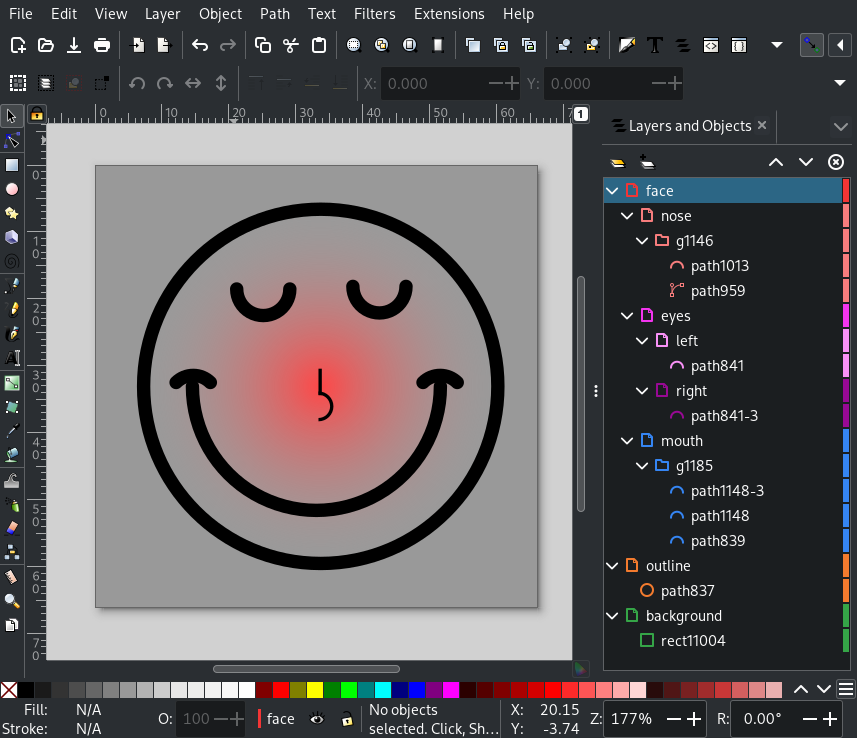
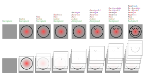
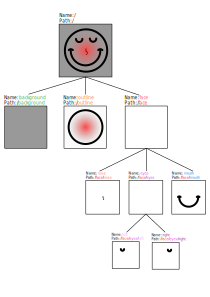

Inkscape Layer Utils
====================

Simple utils to interact with Inkscape SVG images and their layers.
Typical use case is extracting layers from an input SVG or manipulating attributes of elements in an image
(e.g. coloring certain elements).

Take the following multilayer image as an example:

The architecture of the image can also be visualized like this:

Or as a tree:

The utilities can be used as a library or command line tool. Take a look at the examples section for further explanation.

Examples
--------

All examples can be found in the `examples/ <https://github.com/twyleg/inkscape_layer_utils/tree/master/examples>`_ directory.
