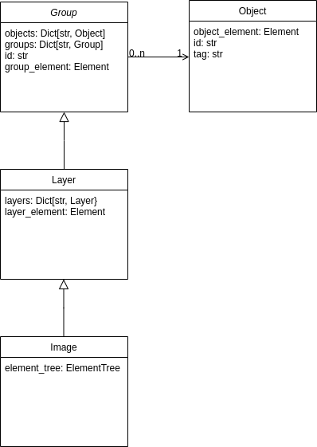

API
===

The inkscape layer utils library provides four different classes:

- Group
- Layer
- Image
- Object

These classes have the following relationship.

The following section describes the API in detail:

.. automodule:: inkscape_layer_utils.image
    :members:
    :undoc-members:
