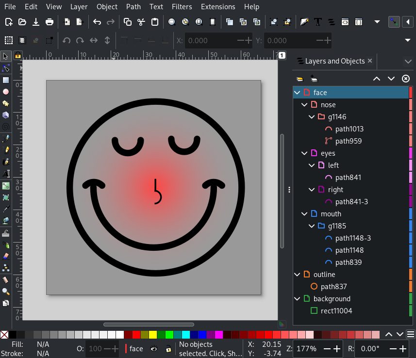
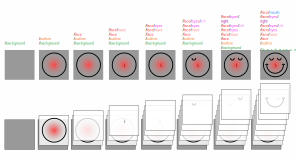
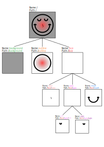

Inkscape Layer Utils
====================

This library provides an easy way to extract layers from Inkscape SVG images and to manipulate the attributes of the
graphical elements of the image (e.g. coloring certain elements).

Take the following multilayer image as an example:

The architecture of the image can also be visualized like this:

Or as a tree:

The utilities can be used as a library or command line tool. Take a look at the examples section for further explanation.

Examples
--------

All examples can be found in the `examples/ <https://github.com/twyleg/inkscape_layer_utils/examples>`_ directory.

Python
^^^^^^

**Extract specific layers**

.. literalinclude:: ../examples/python/example_extract_specific_layers.py
   :language: python
   :encoding: UTF-8
   :lineno-match:

**Extract all layers**

.. literalinclude:: ../examples/python/example_extract_all_layers.py
   :language: python
   :encoding: UTF-8
   :lineno-match:

**Colorize layers**

.. literalinclude:: ../examples/python/example_colorize_layers.py
   :language: python
   :encoding: UTF-8
   :lineno-match:

CLI
^^^

**Extract all layers**

.. literalinclude:: ../examples/cli/extract_layers.sh
   :language: bash
   :encoding: UTF-8
   :lineno-match:

**List layers**

.. literalinclude:: ../examples/cli/list_layer_paths.sh
   :language: bash
   :encoding: UTF-8
   :lineno-match:

Contents
--------

.. toctree::

    api
